# Imbedding Deep Neural Networks 
Repository with code implementing the paper

Andrew Corbett, Dmitry Kangin, Imbedding Deep Neural Networks, ICLR 2022

[[OpenReview](https://openreview.net/forum?id=yKIAXjkJc2F)][[arXiv](https://arxiv.org/abs/2202.00113)]


We include a selection of notebooks to support the results in the paper. These are implemented in Tensorflow using Google Colab. We also include a PyTorch implementation, [inimsolve](inimsolve), in development.


# Experiments
The experiments are contained within the 'notebooks' folder and are adapted for Google Colab. 

The rotating MNIST and bouncing balls data have been obtained from [Yildiz et al., NeurIPS 2019](https://papers.nips.cc/paper/2019/hash/99a401435dcb65c4008d3ad22c8cdad0-Abstract.html) 
via the [implementation](https://github.com/uncbiag/neuro_shooting/tree/master/demos/neurips20) of [Vialard et al., NeurIPS 2020](https://github.com/uncbiag/neuro_shooting/tree/master/demos/neurips20)

## Rotating MNIST
The experiment in section 4.1.1 of the paper compares the proposed model's performance with the existing ones. 
| p-layer | Prediction | 
| :---  | :--- |
| GT    | 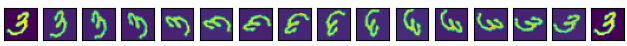 |
| p=0   | 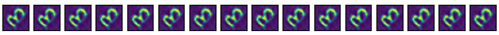 | 
| p=1   | 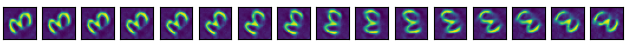 |
| p=2   | 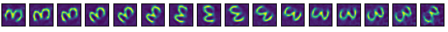 | 
| p=3   | 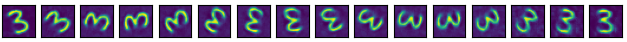 | 
| p=4   | 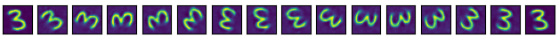 | 

The experiment was performed using [notebooks/run_rotmnist.ipynb](notebooks/run_rotmnist.ipynb)

## Bouncing balls
The bouncing balls experiment in section 4.1.2 shows the performance of the method on the bouncing balls task. 
| p-layer | Prediction | 
| :---  | :--- |
| GT    | 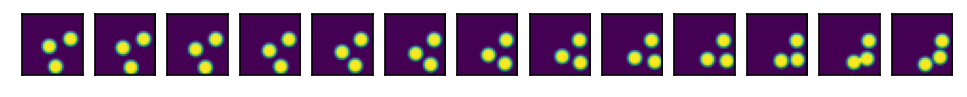 |
| p=0   | 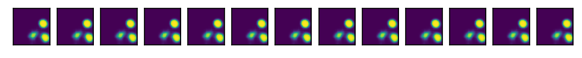 | 
| p=1   | 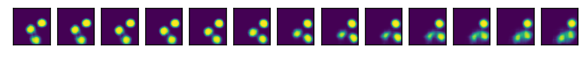 |
| p=2   | 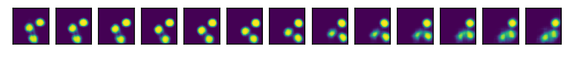 | 
| p=3   |  | 

Notebook: [notebooks/bouncing_balls_in_tensorflow.ipynb](notebooks/bouncing_balls_training.ipynb)

## Extrapolation results
We implement the experiments on extrapolating beyond the optimised layers, described in Sections 4.2 and F.3, in [notebooks/bouncing_balls_with_coupled_weights.ipynb](notebooks/bouncing_balls_with_coupled_weights.ipynb) and [notebooks/rotating_mnist_with_coupled_layers.ipynb](notebooks/rotating_mnist_with_coupled_layers.ipynb) for the bouncing ball and rotating MNIST tasks respectively.

## End-to-end convolutional model

Using [notebooks/bouncing_balls_with_conv.ipynb](notebooks/bouncing_balls_with_conv.ipynb), we demonstrate the ability of the InImNet architectures to be composed of larger convolutional layers (Section F.4), allowing for end-to-end training of an InImNet model.

|      | Testing (pmin=-3) | Training (pmin = -3) | 
| :--- | :---                                                    | :---                                                     |
| GT   | 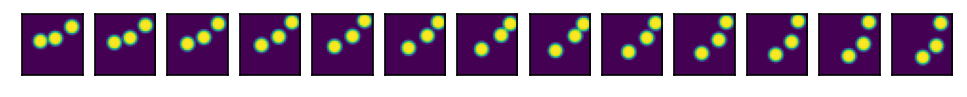 | 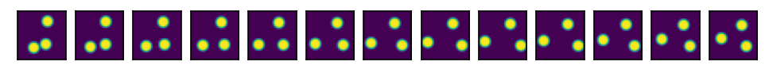 |
| p=0  | 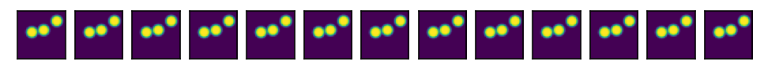  | 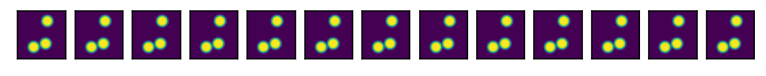  |
| p=-1 | 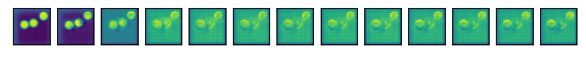  | 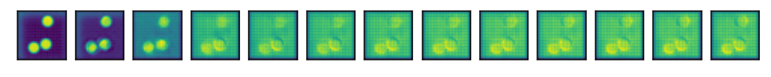  |
| p=-2 | 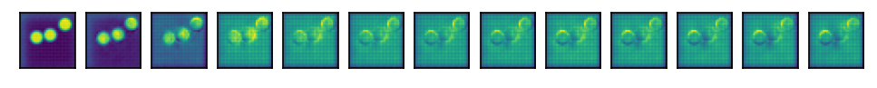  | 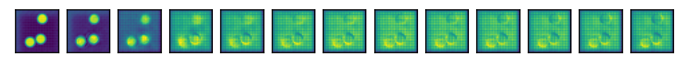  |
| p=-3 |   |   |
| :--- | :---                                                    | :---                                                     |
|      | Testing (pmin=-2) | Training (pmin = -2) | 
| GT   |  | 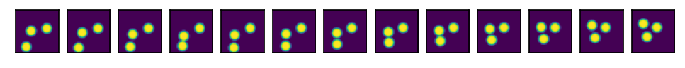 |
| p=0  |   | 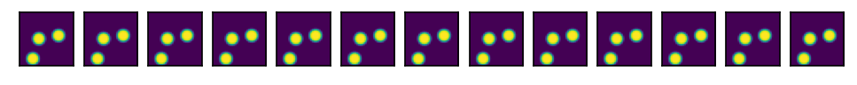  |
| p=-1 | 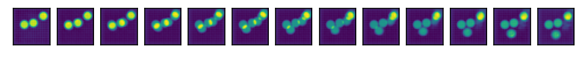  | 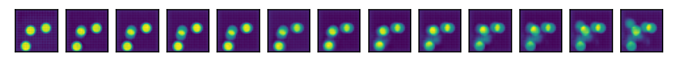  |
| p=-2 | 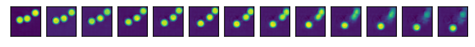  | 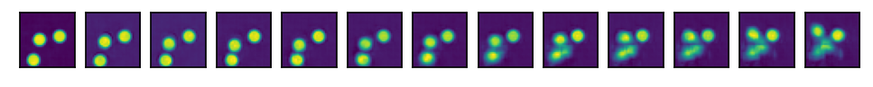  |
|      | Testing (pmin=-1) | Training (pmin = -1) | 
| GT   |  | 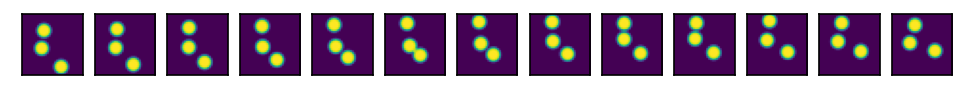 |
| p=0  |   | 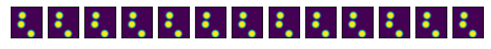  |
| p=-1 | 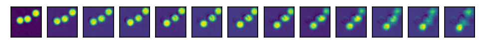  | 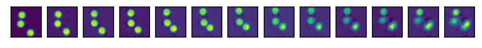  |

---

Citation details:
```
@article{corbett2022inimnet,
  title={Imbedding Deep Neural Networks},
  author={Corbett, A. and Kangin, D.},
  journal={ICLR},
  fjournal={International Conference on Learning Representations}
  year={2022}
}
```
